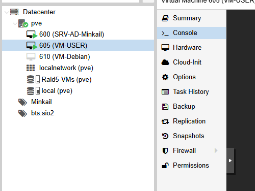
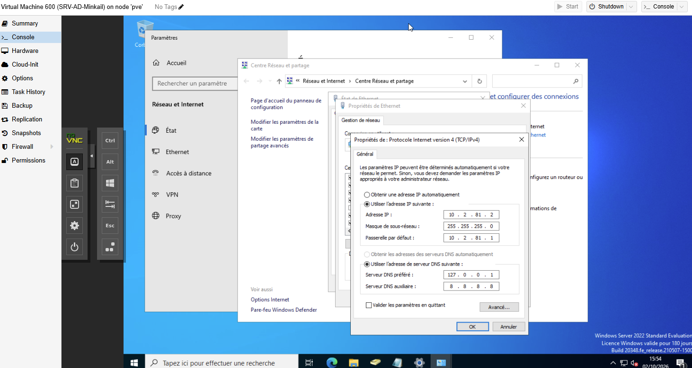

# Active Directory - AP 1 Minkail

Je présente ici la mise en place de mon contrôleur de domaine, avec mes propres captures d'écran.

## 1. Créer la machine virtuelle

J'ai créé une VM sur **Proxmox** (nœud `pve`) avec le **VMID 600** et le nom **SRV-AD-Minkail**. Elle dispose de [NOMBRE_VCPU] vCPU, [RAM_GIO] Gio de RAM et [TAILLE_DISQUE_GIO] Gio de stockage sur le volume **Raid5-VMs**. Sa carte réseau est reliée à [BRIDGE] sur le **VLAN 600**. J'y ai installé **Windows Server 2022 Standard** (version d'évaluation de 180 jours).

Mon pool contient trois machines : le contrôleur de domaine (600), un poste utilisateur Windows 11 (605, `VM-USER`) et un serveur Debian (610, `VM-Debian`).



## 2. Configurer le nom et le réseau

J'ai configuré une adresse IP fixe sur le serveur :

| Paramètre | Valeur |
| --- | --- |
| Adresse IP | 10.2.81.2 |
| Masque | 255.255.255.0 (/24) |
| Passerelle | 10.2.81.1 |
| DNS préféré | 127.0.0.1 (le serveur lui-même) |
| DNS auxiliaire | 8.8.8.8 |

**Pourquoi ces choix :** un contrôleur de domaine doit avoir une IP fixe, car tous les clients en dépendent. Le DNS préféré pointe sur lui-même parce que le rôle DNS est installé sur le serveur et que l'annuaire s'appuie sur ses enregistrements SRV. Le DNS auxiliaire 8.8.8.8 permet de résoudre les noms Internet ; une alternative plus propre est de configurer des redirecteurs dans le DNS du serveur.



## 3. Installer AD DS et DNS

J'ai installé les rôles **AD DS** et **DNS** avec le Gestionnaire de serveur, puis promu le serveur comme premier contrôleur du domaine **[DOMAINE_AD]**. Le nom NetBIOS est **[NOM_NETBIOS]**.

[CAPTURE_03 : installation des rôles]

[CAPTURE_04 : nom du domaine Active Directory]

## 4. Créer les OU, groupes et comptes

J'ai placé cinq OU principales directement sous **[DOMAINE_AD]** : Administration, Groupes, Postes, Serveurs et Utilisateurs. Les services se trouvent dans l'OU **Utilisateurs**, chacun avec sa propre sous-OU.

L'entreprise compte 10 services, chacun avec **un groupe de sécurité global `GG_<service>`** et **3 comptes**, soit 10 groupes et 30 comptes.

| Service (AD) | Service (contexte) |
| --- | --- |
| Reseau-Systeme | Réseau & Système |
| Direction-DSI | Direction / DSI |
| RH-Compta-Juridique | RH / Compta / Juridique / Secrétariat administratif |
| Communication-Redaction | Communication / Rédaction |
| Developpement | Développement |
| Commercial | Commercial |
| Labo-Recherche | Labo-Recherche |
| Accueil | Accueil |
| Visiteurs | Visiteurs |
| Demonstration | Démonstration |

Les noms n'ont ni espace, ni accent, ni `/` ou `&`, car ces caractères posent problème dans les noms de groupes (`sAMAccountName`) et dans les scripts. Les zones « Serveurs » et « Sortie » de la liste du contexte ne sont pas des services avec des utilisateurs : « Serveurs » correspond à l'OU `Serveurs`, et « Sortie » à la zone réseau vers l'extérieur (voir l'[architecture du réseau](../../../Architecture%20du%20r%C3%A9seau/Architecture-du-reseau.md)).

**Pourquoi des groupes par service :** je donne les droits (partages TrueNAS, GLPI) aux groupes et non aux comptes. Quand une personne change de service, je la déplace de groupe sans toucher aux permissions (principe AGDLP simplifié).

[CAPTURE_05 : arborescence des OU]

[CAPTURE_06 : groupes de sécurité]

[CAPTURE_07 : comptes utilisateurs]

## 5. Script de création en production

Pour créer les objets de façon reproductible plutôt qu'à la main, j'utilise le [script PowerShell](Creer-AD-Template.ps1) avec les fichiers [services.csv](services.csv) et [utilisateurs.csv](utilisateurs.csv).

Ce que fait le script :

1. Il vérifie qu'il tourne sur le bon domaine (`$DomaineAttendu`).
2. Il contrôle les CSV : pas de champ vide entre crochets, pas de doublon, exactement 3 personnes par service.
3. Il demande le mot de passe initial au lancement, sans l'écrire dans le dépôt.
4. Il crée les OU, les groupes `GG_<service>` et les comptes **manquants**, puis ajoute chaque compte à son groupe.
5. Il **ne supprime jamais** d'objet existant et peut donc être relancé sans risque.

Les noms et prénoms des 30 comptes de `utilisateurs.csv` sont fictifs.

Pour l'exécuter, je me place sur le contrôleur de domaine dans PowerShell en administrateur, après avoir remplacé `[DOMAINE_AD]` dans le script :

```powershell
cd "C:\Scripts\AD"
.\Creer-AD-Template.ps1
```

[CAPTURE_08 : exécution du script]

## 6. Vérifier le fonctionnement

J'ai contrôlé le nom du serveur, l'adressage, la résolution DNS et l'état du domaine avec les commandes suivantes :

```powershell
hostname
ipconfig /all
Get-ADDomain
Resolve-DnsName [DOMAINE_AD]
dcdiag /q
```

J'ai ensuite joint le poste **VM-USER** (Windows 11) au domaine et ouvert une session avec un compte de test.

[CAPTURE_09 : résultats des tests]
