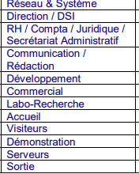

# Architecture du réseau

## Répartition et adressage

| Élément | Mon infrastructure |
| --- | --- |
| Hyperviseur | Proxmox VE, nœud `pve` |
| Pool / tag | Minkail / `bts.sio2` |
| VLAN | 600 |
| Réseau IP du contrôleur de domaine | 10.2.81.0/24 |
| Stockage des VM | Raid5-VMs |
| Pont Proxmox | [NOM_DU_BRIDGE] |
| Contrôleur de domaine | VMID 600, SRV-AD-Minkail, 10.2.81.2 |
| Poste utilisateur | VMID 605, VM-USER (Windows 11), [IP_VM_USER] |
| Serveur Debian | VMID 610, VM-Debian, [IP_VM_DEBIAN] |
| Passerelle | 10.2.81.1 |

## Zones du contexte

Le dossier de contexte découpe l'entreprise en zones, que je reprends pour la segmentation.

| Type | Zones |
| --- | --- |
| Services avec utilisateurs | Réseau & Système, Direction / DSI, RH / Compta / Juridique / Secrétariat administratif, Communication / Rédaction, Développement, Commercial, Labo-Recherche, Accueil, Visiteurs, Démonstration |
| Zone serveurs | Serveurs |
| Zone de sortie | Sortie |

## Schéma

[INSÉRER_ICI_UN_SCHÉMA_DE_VOTRE_RÉSEAU]

## Flux

1. Mes postes clients utilisent **10.2.81.2** (le contrôleur de domaine) comme serveur DNS pour résoudre **[DOMAINE_AD]**.
2. Ils joignent **SRV-AD-Minkail** pour l'authentification et les stratégies de groupe.
3. Les accès entre VLAN et vers Internet passent par la passerelle **10.2.81.1** ([ÉQUIPEMENT_DE_ROUTAGE]).

Je compléterai cette page avec les VLAN, les règles de pare-feu et les tests réellement mis en place. La segmentation de bout en bout est traitée dans l'[AP 2](../AP%202/README.md).
